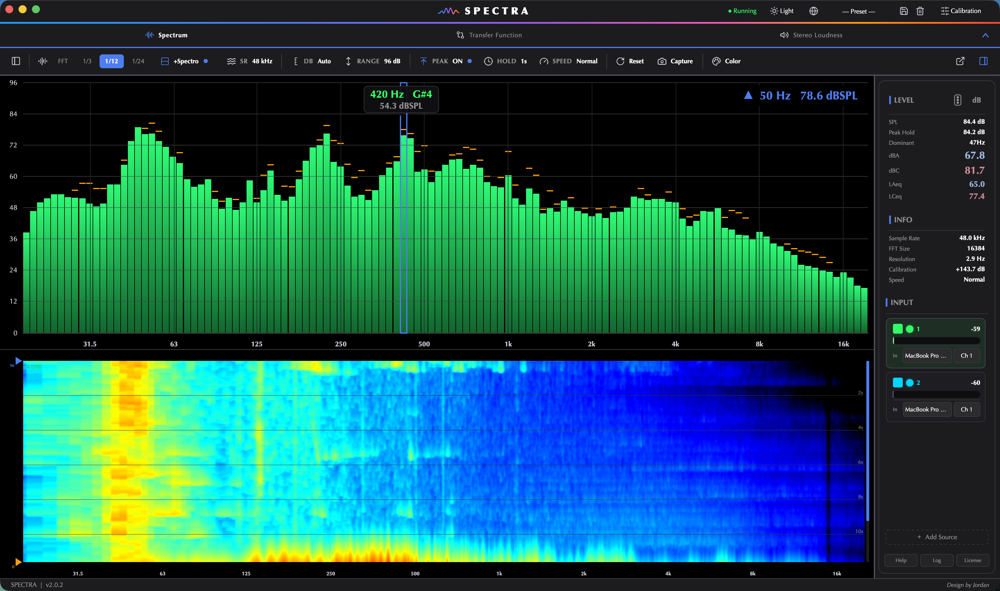

<div align="center">

# 〰️ SPECTRA

### *See your sound.*

**정밀 음향 측정을, 가장 세련되게.**
Spectrum Analyzer · by **WAYAUDIO**


</div>

---

SPECTRA는 소리를 **눈으로 보는** 음향 측정 도구입니다. 실시간 스펙트럼 분석부터 스피커·룸 전달함수(Transfer Function), 방송 라우드니스(LUFS)까지 — 프로 현장의 측정을 하나의 앱에 담았습니다.



> 위 이미지는 플레이스홀더입니다. 실제 스크린샷은 `docs/img/` 에 채웁니다.

## ✨ 기능

| 탭 | 설명 |
|---|---|
| **Spectrum** | 실시간 주파수 분석 — FFT · 1/3~1/24 옥타브 · 스펙트로그램, 멀티채널 동시 오버레이, 정밀 SPL/LAeq |
| **Transfer Function** | 스피커·룸 측정 — 매그니튜드 · 위상 · 코히어런스 · 임펄스 응답, 자동 딜레이, 다지점 비교 |
| **Stereo Loudness** | 방송·음원 라우드니스 — 벡터스코프 · 라우드니스 레이더 · M/S/I · True Peak · LRA |

- 🌗 다크 / 라이트 테마
- 🎚️ 마이크 캘리브레이션 (94 / 114 dBSPL 기준기)
- 📊 자유 배치 SPL 미터
- 🔊 신호 발생기 내장 (Pink · White · Sweep · File)
- 📸 캡쳐 & 비교 (Δ)

## 📦 설치 (사용자)

**macOS** — 받은 `.dmg`를 열고 **SPECTRA**를 **Applications**로 드래그.
처음 실행 시 보안 경고가 뜨면 아이콘 **우클릭 → 열기** 한 번.

요구사항: macOS 12+ (Apple Silicon / Intel) · Windows 10+

## 🛠️ 빌드 (개발자)

```bash
# macOS Apple Silicon (arm64)
bash build_silicon.sh

# macOS Intel (x86_64, Rosetta 자동)
bash build_intel.sh
```

- **Windows**: `v*` 태그 push 시 GitHub Actions(`.github/workflows/build-windows.yml`)가 자동 빌드 → `SPECTRA.exe` 아티팩트. 또는 Windows에서 `pyinstaller WSA2_Windows.spec`.
- **브랜드 DMG**: `make_dmg.sh` (빌드 스크립트가 자동 호출)
- **버전 올리기**: `bash bump_version.sh 1.6` (또는 `1.5.1` 패치) — 모든 버전 표기 일괄 갱신

## 🔐 코드 서명 · 노타라이즈

미서명 앱은 첫 실행 시 경고가 떠요. Apple Developer ID로 서명·노타라이즈하려면 **[`SIGNING.md`](SIGNING.md)** 참고.
(환경변수 `SPECTRA_SIGN_ID` / `SPECTRA_NOTARY_PROFILE` 설정 시 빌드가 자동 처리)

## 📖 문서

| | |
|---|---|
| 사용 설명서 | [`MANUAL.html`](MANUAL.html) — 초보자용 전기능 가이드 (앱 안 **Help** 버튼으로도 열림) |
| 릴리스 노트 | [`RELEASE_NOTES.md`](RELEASE_NOTES.md) |
| 제품 소개 | [`LANDING.html`](LANDING.html) |

## 📂 주요 파일

```
wayaudo2.py            메인 소스 (단일 파일)
WSA2.spec / build_*.sh PyInstaller 빌드 (Silicon / Intel)
WSA2_Windows.spec      Windows 빌드 (+ version_info.txt · icon.ico)
make_dmg.sh            브랜드 DMG 생성
sign_app.sh / notarize_dmg.sh   서명 · 노타라이즈
bump_version.sh        버전 일괄 변경
splash.png · icon.icns · app_icon_1024.png   브랜드 자산
```

---

<div align="center">

© WAYAUDIO · *See your sound.*

</div>
